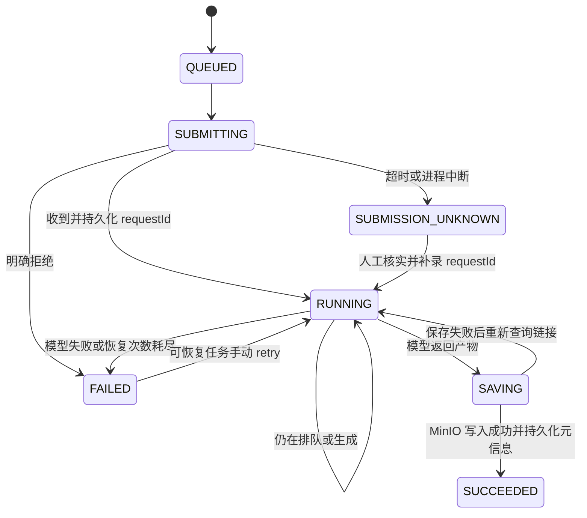

# 视频生成任务：第一阶段联调准备

> 最新验收（2026-10-02）：Seedance Mini 已完成 1 次真实文生、3 次真实图生、私有归档及 15.146 秒带字幕成片；117 项后端回归通过。当前实例运行真实生成模式，用户已授权不限次数与预算。真实结果见 [Seedance 接入与验收](seedance-video.md)、[成片](acceptance/seedance-film.mp4) 和 [脱敏验收记录](acceptance/seedance-real.json)。下文分阶段测试与旧运行配置保留为历史记录；项目按本次确认范围已完成。按用户要求，实际账单核对、正式人工评分及历史 SiliconFlow 三笔未知提交核实均移出验收范围，不再作为待办；费用未知、未评分和旧任务状态保留原记录。


原项目的 `/analysis` 负责视频理解。本次新增 `/generation/tasks`，负责文生视频／图生视频的提交、异步查询和产物保存。两条链路共用登录鉴权、MySQL、MinIO，生成任务独立保存，避免混用分析任务状态。

## 默认配置与运行

默认 `GENERATION_PROVIDER=mock`、`GENERATION_PAID_ENABLED=false`。mock 不访问任何模型 API，而是把仓库内的一秒蓝色视频样本保存到 MinIO，验证完整链路。样本不代表模型质量。

沿用 README 的中间件与后端启动方式；Flyway 会执行 `V4__create_generation_tasks.sql` 与 `V5__generation_inputs_and_trace.sql`。这一阶段生成队列直接持久化在 MySQL：提交完成 INSERT 后返回，后台定时领取任务。生成链路自身无需 MQ 投递，因此不存在「DB 已提交但 MQ 消息丢失」的间隙。整个原应用仍需其原有中间件正常运行。

Windows 验证：

```powershell
$env:JAVA_HOME = 'C:\Program Files\Eclipse Adoptium\jdk-25.0.0.36-hotspot'
cd server
.\mvnw.cmd -B test
```

JDK 至少 21。本机验证使用已安装的 JDK 25，未更改系统默认 Java。POM 显式声明 Lombok 注解处理器，兼容新版 JDK 的注解处理规则。测试使用 H2、本地 HTTP/S3 模拟端点和内存拦截器，无真实模型请求，也无需运行 Docker。mock 示例 MP4 已作为资源纳入项目，运行时无需 FFmpeg。

## 真实中间件验收

Docker 引擎正常运行后，在仓库根目录执行：

```powershell
.\scripts\test-generation-infrastructure.ps1 -JdkHome 'C:\Program Files\Eclipse Adoptium\jdk-25.0.0.36-hotspot'
```

脚本使用 `docker-compose.generation-it.yml` 创建随机项目名、随机宿主端口和临时密码的 MySQL 8、Redis、MinIO。容器只绑定 127.0.0.1，不读取生产 `.env` 或挂载生产数据。端口分配遵循 [Docker Compose ports 说明](https://docs.docker.com/reference/compose-file/services/#ports)。结束时清理本次随机项目及其匿名卷，并还原脚本临时设置的环境变量。

原 MinIO 镜像在本次环境中无法拉取，官方归档二进制地址也返回 410。主 Compose 和验收 Compose 改为共用 `infrastructure/minio/Dockerfile`，按 [MinIO 官方源码构建方式](https://github.com/minio/minio#install-from-source) 构建原版本：固定 `RELEASE.2025-09-07T16-13-09Z` 对应 commit `07c3a429bfed433e49018cb0f78a52145d4bedeb`。首次需要下载 Go 构建镜像、源码和依赖；后续可复用本地构建缓存。

Maven 的 `generation-integration` profile 运行 `GenerationInfrastructureIT`。它顺序启动三个真实 Spring HTTP 服务实例，使用原 AuthService、鉴权拦截器、Flyway、数据库仓库、MinIO SDK 和定时 worker。测试应用只导入 MockGenerationProvider，强制 mock 配置和关闭付费调用；不加载真实模型适配器。

验收检查：当前 V1–V8 原始 MySQL 迁移、ASCII 大小写敏感幂等 key、八个并发 HTTP 提交、用户隔离、注册登录和 Redis 会话、QUEUED/RUNNING/SAVING 状态在应用重启后恢复、对象写入后数据库未确认时重写固定对象、未知提交暂停、multipart 私有参考图片上传与去重、图生视频任务、owner-only 参数与时间线、MinIO 私有图片／视频签名下载及视频字节／长度／SHA-256 一致性。另覆盖分镜修订、镜头批量生成与局部重生成、项目额度持久化、真实 FFmpeg 成片、人工评分及报告导出；完整说明见 [创作平台](creator-platform.md)。

成功时生成 `server/target/generation-infrastructure-acceptance.json`；JUnit 原始结果保存在 `server/target/failsafe-reports/`。Docker 不可用或测试失败会明确失败，不作为跳过或验收成功。普通 `mvnw test` 仍只运行无需 Docker 的测试。

前端执行 `npm ci`、`npm test` 和 `npm run build`。本轮前端日志保存到 `server/target/milestone-one-client-tests.log` 与 `milestone-one-client-build.log`，随后运行 `scripts/archive-generation-acceptance.ps1`，将零付费验收、测试计数、上游基线 commit 与本地变更文件 SHA-256 清单保存到 `docs/acceptance/milestone-one.json`。脚本拒绝失败、跳过或源码比验证结果更新的记录；仅归档计数和脱敏检查项，不复制 JUnit XML 中可能存在的运行参数。

## 接口

所有接口需要原项目登录 token：`Authorization: Bearer <token>`。返回统一 `{code,message,data}`。任务不存在或不属于当前用户时返回 404。

| 请求 | 用途 |
| --- | --- |
| `POST /generation/tasks` | 提交；必须提供 `Idempotency-Key` |
| `GET /generation/capabilities` | 当前模型的模式、尺寸、可选参数和可调用状态 |
| `POST /generation/assets` | multipart 字段 `file` 上传私有 PNG/JPEG 参考图片 |
| `GET /generation/assets/{id}` | 查询本人素材元数据 |
| `GET /generation/assets/{id}/preview` | 获取本人图片的短时效预签名链接 |
| `GET /generation/tasks` | 本人最近 50 个任务 |
| `GET /generation/tasks/{id}` | 查询任务状态、模型任务 ID、产物信息、错误码 |
| `GET /generation/tasks/{id}/trace` | 本人的原始提示词、规范化输入、提交参数快照与阶段时间线 |
| `GET /generation/tasks/{id}/artifact` | 保存成功后生成短时效 MinIO 下载地址 |
| `POST /generation/tasks/{id}/retry` | 恢复已有模型任务的查询／保存，不重新提交模型 |
| `POST /generation/tasks/{id}/reconcile` | 为提交结果未知的任务补录已核实的模型 requestId |

文生视频请求示例（确认服务处于默认 mock 配置后使用）：

```http
POST /generation/tasks
Authorization: Bearer <token>
Idempotency-Key: internship-demo-001
Content-Type: application/json

{
  "kind": "TEXT_TO_VIDEO",
  "prompt": "一只猫在草地上奔跑，镜头缓慢推进",
  "negativePrompt": "模糊",
  "imageSize": "1280x720",
  "seed": 42
}
```

首次提交返回 **202**：`data.task.id` 为本地任务 ID，`data.reused=false`。相同用户、相同 key、相同归一化参数返回 **200** 和原任务（包括已失败或已完成的任务）；相同 key 用于不同参数返回 **409**。key 区分大小写，允许 1–128 位 ASCII 字母、数字和 `_.:-`。主动生成另一个视频时使用新 key。

图生视频先通过 `POST /generation/assets` 上传图片，再以 `kind=IMAGE_TO_VIDEO` 和 `referenceImageId=<返回的素材 ID>` 提交。图片最大 5 MiB、边长最大 4096，校验声明格式、尺寸和完整解码。同一用户相同 SHA-256 去重；素材 key 位于 `generation-inputs/{userId}/{sha256}.png|jpg`，预览和读取均校验所有权，桶保持私有。

兼容旧请求的 `image=data:image/png;base64,...` 或 JPEG data URL：提交前先归档为素材，任务只存素材 ID。不能同时提供 image 与 referenceImageId。原 V4 已存的内联任务仍可执行，但追溯接口不返回其 base64。新 worker 在内存中读取归档图片、核对大小与 SHA-256 后生成供应商所需 data URL，不需要向模型平台公开 MinIO。对象写入成功、数据库插入失败时可能存在孤立对象；相同内容重传会复用固定 key，生命周期清理尚未实现。

默认尺寸为 `1280x720`、`720x1280`、`960x960`；prompt 非空、最多 2000 字；负向提示最多 2000 字；seed 可省略，提供时需非负。模型名称由服务端配置决定。各模式的 enabled、sizes、negative-prompt、seed、max-prompt-length 分别配置在 `generation.text.*` 与 `generation.image.*`（环境变量见 `.env.example`）。更换模型须同步配置其实际能力；前端从 capabilities 接口生成选项，后端独立校验。不存在通用 duration 参数。

前端新增「AIGC 视频生成」入口，也可访问 `/?generation`。沿用现有登录态，支持文字／参考图片输入、任务提交、状态轮询、归档视频预览、最近任务、查询／保存恢复、未知提交 requestId 补录和处理时间线。网络丢失响应时，相同输入沿用当前账号 sessionStorage 中的幂等 key；只存摘要和 key，不存提示词或图片。切换账号会清除页面数据并忽略旧请求。主动发起另一次相同内容创作需点击「开始下一次创作」。Mock 模式始终展示固定样例，不代表真实生成效果。

成功查询示例：

```json
{
  "code": 0,
  "message": "success",
  "data": {
    "id": "<local-task-id>",
    "provider": "mock",
    "model": "mock-video",
    "state": "SUCCEEDED",
    "remoteId": "mock-<local-task-id>",
    "artifactKey": "generated/<user-id>/<local-task-id>/video.mp4",
    "artifactSize": 4441,
    "artifactSha256": "<sha256>",
    "errorCode": null,
    "recoverable": false,
    "attempts": 0,
    "createdAt": 0,
    "updatedAt": 0
  }
}
```

时间字段实际为毫秒级 Unix 时间。状态响应不返回原提示词、图片或供应商签名 URL。`/artifact` 在产物尚未保存时返回 409；已完成时 `data` 是按需生成的一小时有效 MinIO 预签名链接。

## 状态与恢复规则



- **并发幂等**：数据库唯一约束 `(user_id,idempotency_key)` 决定唯一任务身份，`request_hash` 校验规范化生成参数。后台通过原子条件更新领取五分钟租约，并以 `lease_token` 防止过期 worker 覆盖新状态。
- **重启恢复**：QUEUED、RUNNING、SAVING 的租约过期后自动继续。SUBMITTING 过期转为 SUBMISSION_UNKNOWN，不自动发出第二次模型提交。
- **提交边界**：先持久化 SUBMITTING 再发 POST。提交请求关闭 HTTP 隐式重试和重定向；4xx（408 除外）视为明确拒绝；408、网络错误、5xx 或不完整成功响应视为结果未知。平台的 `X-Trace-Id` 使用本地 task ID，便于核对，**不视为供应商幂等保证**。脱敏分类保留 HTTP 状态、传输错误、无效响应或缺失 requestId，不保存供应商响应正文；旧任务缺失的错误细节不会被事后补造。
- **可追溯性**：原始提示词与规范化输入分开保存；SUBMITTING 与最终参数快照、预算预留在短事务内一起提交。状态变化、错误码／错误次数、人工恢复与补录事件同步保存；不为每次正常 RUNNING 轮询重复生成事件。参考图片以 ID、大小、格式和 SHA-256 记录，快照中不保存图片 base64、API key 或临时签名链接。已有 V4 任务不会伪造历史时间线。
- **提交前失败**：图片读取／完整性检查或参数准备失败时标记 SUBMISSION_PREPARATION_FAILED；授权策略变更或额度耗尽时标记 SUBMISSION_AUTHORIZATION_DENIED。两类均未调用供应商，不标记未知提交。
- **保存恢复**：MinIO 固定路径 `generated/{userId}/{taskId}/video.mp4`；数据库保存对象 key、大小与 SHA-256。写入后数据库确认失败时可以重写同一对象，不会产生随机命名的重复对象。保存失败后重新查询供应商以刷新临时链接，不重新生成视频。
- **有限重试**：查询／保存错误累计最多五次，按 4/8/16/32/60 秒退避；等待正常生成时每五秒查询。超过 24 小时仍未完成则标记可恢复的 POLL_TIMEOUT。成功查询不会清零保存错误的累计次数。
- **手动恢复**：仅 FAILED、`recoverable=true` 且有 remoteId 的任务允许 retry；重置错误次数并继续查询原任务。模型已明确失败和提交明确拒绝的任务不能用 retry 重新扣费。

补录请求示例：

```http
POST /generation/tasks/{id}/reconcile
Authorization: Bearer <token>
Content-Type: application/json

{"requestId":"<从供应商核实的原任务-ID>"}
```

补录仅修改本地状态，不执行模型提交。必须先用本地 task ID 对应的 trace 信息核实原任务，避免误绑定供应商账户内的其他视频。`(provider,remote_id)` 唯一约束禁止同一模型任务重复绑定。若供应商无法查明未知提交的结果，保留 SUBMISSION_UNKNOWN；本系统不会声称可以实现跨供应商网络边界的严格 exactly-once。

`GENERATION_RECOVERY_ENABLED` 默认 false，可独立开放已有任务的状态查询与归档，不授予付费生成权限。仍需有效供应商密钥、HTTPS 地址和精确产物域名配置。`GENERATION_PAID_ENABLED=false` 时，新提交及真实 QUEUED 任务仍被拦截；查询、保存和已核实 requestId 的补录不增加调用次数或预算预留。无效 requestId 不发状态请求，恢复开关关闭时补录／retry 拒绝而保留原记录。原任务未知费用预留保持不变。

## 真实模型接入配置（首次开发时未执行）

SiliconFlow 适配器按官方 [提交接口](https://api-docs.siliconflow.cn/docs/api/video-submit-post) 与 [状态接口](https://api-docs.siliconflow.cn/docs/api/video-status-post) 实现，调用 `/video/submit` 和 `/video/status`，支持文生与图生。模型默认示例为 Wan2.2 的 T2V/I2V；上线前需核实账户可用模型和计费。

**本次未启动任何付费模型调用。** 用户确认真实调用的模型与预算后，操作人员才可配置 `GENERATION_PROVIDER=siliconflow`、`GENERATION_PAID_ENABLED=true`、专用 `GENERATION_API_KEY`。需配置 `GENERATION_ARTIFACT_HOSTS` 为供应商视频输出域名的精确逗号分隔白名单，禁止通配符。缺少 key 或白名单也会拒绝真实调用。真实开关同时在 API 提交与 worker 执行前检查；关闭开关不会自动提交已入队的真实任务。已有 mock 任务保留其原 provider。

付费开关还需配合下列显式授权字段，默认空／0 均禁止新提交：

- `GENERATION_AUTHORIZATION_ID`：本次审批的唯一标识；重启不得更换 ID 来绕过额度。
- `GENERATION_APPROVED_MODELS`：已批准的具体模型标识，逗号分隔。
- `GENERATION_MAX_PAID_TASKS`：本次最多模型提交次数，文生／图生合并计数。
- `GENERATION_BUDGET_LIMIT`：本次 CNY 预留总额。
- `GENERATION_RESERVATION_PER_TASK`：经核实的保守单次预留金额，两个模式用相同上界。

数据库条件更新在并发 worker 间统一限制任务数和预留金额，额度与任务提交边界同一事务持久化。授权策略摘要固定，相同授权 ID 修改模型名单、额度或单次预留额会被拒绝，需经新的明确审批使用新 ID。模型失败、明确拒绝与结果未知都保留预留记录；查询／保存恢复不再次预留、不重新提交。耗尽额度的任务在调用前失败。

这部分是调用次数限制与预算预留，**尚非供应商实际账单结算，也无法替代供应商硬预算设置**。执行真实验收前须核实当前单次价格上界并限制供应商额度。此门禁目前覆盖新增视频链路；原视频理解链路使用其原有模型服务，因此不得把原视频分析、ASR 或未来脚本／配音调用混入本轮非付费验收。

下载仅接受白名单上的 HTTPS 443 链接，拒绝重定向和私有 DNS 地址，最大 256 MiB，检查 MP4 文件头。下载不携带模型 API key。网络请求和 MinIO 传输有超时；数据库未确认前不会对外宣称完成。

## 第一阶段验证记录

自动测试覆盖 REST 校验／鉴权、文生／图生闭环、并发提交和租约竞争、重启恢复、超时禁止重投、补录冲突、查询／保存五次失败后恢复、成功提交后首次 DB 写失败、供应商 HTTP 协议解析，以及通过 MinIO SDK 向本地 S3 模拟服务上传实际 MP4。

2026-10-01 本轮验收通过：53 项普通后端回归测试（此前 45 项加本轮 8 项）、1 项真实 MySQL 8／Redis／MinIO 综合测试、28 项前端测试与 Vue 生产构建；失败、错误和跳过均为 0。V1–V5 SQL 迁移、列级 ASCII collation、真实 HTTP 服务、定时 worker、应用重启和私有图片／视频签名下载均已通过。另在 MySQL 做纯数据库并发额度测试：10 元预留上限下只允许一个 6 元预留，未加载付费 provider，也未产生模型调用。永久脱敏结果见 [第一阶段验收记录](acceptance/milestone-one.json)，可使用上述脚本重新生成。

浏览器人工检查覆盖未登录生成入口、工作区切换与布局；尚未进行登录后的完整浏览器端到端测试。已登录提交、multipart 上传、状态查询、权限及重启恢复由真实后端 HTTP 验收覆盖，不能把这两种验证混写成完整浏览器验收。

尚未执行真实 SiliconFlow 联调；本次隔离验收只加载生成与鉴权模块，未验证原视频分析链路的 RocketMQ／Qdrant／ASR 等服务，也未使用生产凭据。普通测试仍用 H2 的 MySQL 兼容模式，真实 SQL 与存储行为由新增的综合测试补充验收。

分镜、镜头版本、创作工作台、成片合成及人工质量与成本报告已接入，完整运行方式及当前验收见 [创作平台说明](creator-platform.md)。上文为第一阶段历史记录，不代表新增功能的最终验收。生产规模能力仍受对象生命周期、实际计费对账、任务取消、并发控制与长任务租约续期限制；机器需同步时钟。

## SiliconFlow 真实联调补充（2026-10-02）

收到专用密钥并按用户授权执行最多 4 次、总预算 10 CNY 的视频联调。`Wan-AI/Wan2.2-T2V-A14B` 一次提交成功：真实 H.264 视频 720×1280、5.0625 秒，311942 字节，私有 MinIO 归档与下载 SHA-256 一致。首次归档因精确域名白名单不匹配而失败；核实实际输出域名 `s3.6scloud.com` 后恢复原任务查询和保存，未重新生成。生成中应用重启、重复原意图均复用同一本地与供应商任务，额度不增加。

随后从该真实视频抽取合成水杯画面作为私有参考图，将真实 DeepSeek 分镜编辑为人工修订 3 并确认，提交三个 `Wan-AI/Wan2.2-I2V-A14B` 镜头。三个请求均为 SUBMISSION_UNKNOWN，未取得供应商 requestId；旧日志未保留 HTTP 错误分类，无法还原原因。不自动重发，不释放未知费用预留。全局台账为 4 次提交、10 CNY 预留；本轮已停止新增付费请求并恢复默认 Mock 运行，保留全部真实记录和产物。

供应商费用页在核对截点显示一条文生视频、2 CNY；这不是三次未知提交的最终结算，不能把缺少账单行当成未接受的证明。尚无真实图生视频产物及真实多镜头成片，不支持模型效果或质量提升结论。

已补齐脱敏 HTTP／传输／无效响应分类，保证未知任务重启和原意图复用不重投；17 项定向测试、101 项后端回归全部通过，随后前端生产构建和独立应用打包启动成功。本轮未改前端逻辑，54 项前端测试及真实中间件 18 检查为此前验收记录。测试不调用付费模型。

证据：[真实验收记录](acceptance/siliconflow-real.json)、[真实文生视频](acceptance/siliconflow-t2v.mp4)、[原任务追踪](acceptance/siliconflow-t2v-trace.json)、[确认分镜](acceptance/siliconflow-real-storyboard.json)、[未知提交核对清单](acceptance/siliconflow-reconciliation.json)。核实原供应商 requestId 后可用 reconcile 接口恢复原任务；任何额外付费提交需新的明确授权。

## Seedance Mini 接入补充（2026-10-02）

已新增独立 Seedance 适配器并配置本机方舟密钥，控制台只读核实 Mini 已开通。本地应用现运行 Seedance 配置，付费生成关闭；116 项后端回归、54 项前端测试、生产构建和独立启动通过。原 SiliconFlow 未知任务、4 次／10 CNY 预留和真实文生视频归档保持不变。本轮没有发起 Seedance 模型请求，真实图生与多镜头成片仍待新的明确授权。

接入参数、恢复方式与限制见 [Seedance Mini 接入说明](seedance-video.md)，脱敏运行证据见 [Seedance 工程验收](acceptance/seedance.json)。以上更新替代文中历史运行配置，不把工程测试算作真实模型效果验收。